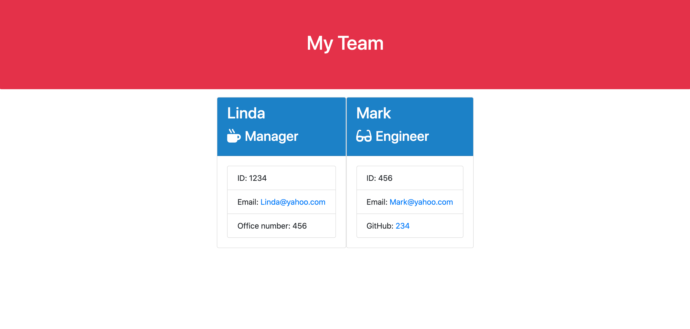

# Team-Generator-Homework

> A software engineering team generator. So the manager can access the team members information.

## Table of contents
* [General info](#general-info)
* [Goals](#goals)
* [Usage](#usage)
* [Screenshots](#screenshots)
* [Features](#features)
* [Contact](#contact)

## General info
A team generator. Designed to prompt the user questions and store the answers and display the team members information on a webpage. 

## Goals
*The goal of this application was to receive the information of a team by using inquirer
*To be able to add as many team members as possible

## Usage
User initializes the application in the command line using Node app.js. Then the user is prompted on what type of employee they are wanting to add to the system by choosing one of the options. The options being manager, intern, or engineeer.
Once all the information is completed the user chooses to create another employee or not by answering "yes" or "no".
Then application will create an HTML file that displays a nicely formatted team roster based on the information provided by the user

## Screenshots

## Technologies
1. Javascript
2. Jest
3. Inquirer
4. Node.js
5. Html
6. CSS

## Status
Project is: _in progress_ because I am still learning.

